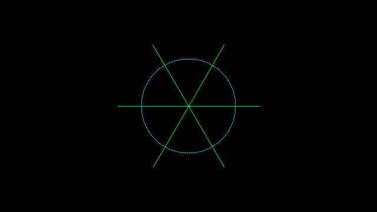

# VGE — Vector Graphics Engine

<!-- agents:status:begin -->
> **Status:** active · Version: `0.1.0-dev.1` · License: MIT · [Issues](https://github.com/theesfeld/vge/issues)
<!-- agents:status:end -->

VGE draws **true vectors**: geometry (`line`, `circle`, transform) lights **individual pixels**.  
This is not a sprite or bitmap blitter.

Hot path on **x86_64**: GNU assembly (`asm/x86_64/vge.s`).  
Other targets use a portable C path with the same C ABI.

<p align="center">
  
</p>

---

## Performance (read this first)

| Stage | Role | Measured rate (release, this class of host) |
|-------|------|-----------------------------------------------|
| **Raster** | Geometry → pixels in **system RAM** | Draw-only: **~10 000 FPS** at 1280×720; **~1 700 FPS** at 2560×1600 |
| **Present** | Put pixels on glass or in a terminal | FB blit full HD: **~800 FPS**. Kitty present (capped): **thousands of FPS** at default density |
| **Pace** | Optional lock to `VGE_HZ` | Use `VGE_HZ=0` for uncapped present rate |

**Fact:** The engine is not the bottleneck. Full-frame terminal present was the bottleneck when every cell used a slow format write or a huge base64 image. That path is fixed: one buffer, one write, capped pixel size, region overlay.

```bash
cargo run --release --example bench
cargo run --release --example profile_present   # present FPS by backend
```

| Present backend | Size (80×24 cells) | Present rate (order of) |
|-----------------|--------------------|-------------------------|
| ASCII | 80×24 | >100 000 FPS |
| Half-block | 80×48 | >50 000 FPS |
| Kitty | 320×192 (capped density) | >3 000 FPS |

---

## Overlay model (vectors on top of text)

VGE can fill a **cell rectangle** only. Text and inputs stay around that region.

```text
┌ status / keys ─────────────────────────────┐
│  [  vector viewport — Kitty or half-block ] │
│  [  present_at(surface, backend, viewport) ]│
└ draw_us / present_us / fps ────────────────┘
```

```rust
use vge::term::{detect_backend, enter_overlay, leave_overlay, present_at, Viewport,
                surface_size_for_viewport};
use vge::{Surface, BLACK, GREEN};

let backend = detect_backend();
let vp = Viewport::centered_frac(0.7, 0.65); // cells
let (w, h) = surface_size_for_viewport(backend, vp);
let mut s = Surface::new(w, h);
s.clear(BLACK);
s.line(0, 0, w as i32 - 1, h as i32 - 1, GREEN);

enter_overlay()?;
present_at(&s, backend, vp)?;   // does not wipe the whole TTY chrome
// … print text at other cell positions …
leave_overlay()?;
```

| API | Purpose |
|-----|---------|
| `Viewport { col, row, cols, rows }` | Cell box (0-based origin) |
| `Viewport::centered_frac(fw, fh)` | Centered box as a fraction of the terminal |
| `present_at(surface, backend, vp)` | Place pixels in that box only |
| `enter_overlay` / `leave_overlay` | Hide cursor; keep main screen |
| `enter_fullscreen` / `leave_fullscreen` | Alternate screen (optional) |

---

## Install

```toml
# Cargo.toml
vge = { git = "https://github.com/theesfeld/vge" }
```

C header: `include/vge.h`  
Link the static/shared library from `cargo build --release` (`libvge.a` / `libvge.so`).

---

## Quick start (Rust)

```rust
use vge::{Surface, Xform, GREEN, BLACK};

let mut s = Surface::new(640, 360);
s.clear(BLACK);
s.line(10, 10, 630, 350, GREEN);
s.circle(320, 180, 80, GREEN);

let m = Xform::identity()
    .translate(320.0, 180.0)
    .rotate_deg(15.0)
    .translate(-320.0, -180.0);
s.line_xf(&m, 100.0, 180.0, 540.0, 180.0, GREEN);
```

Linux frame buffer (direct glass):

```rust
// Draw in RAM, blit once per frame (do not plot into FB per pixel).
let mut fb = vge::fb::Framebuffer::open_default()?;
let mut back = Surface::new(fb.width(), fb.height());
// … draw into `back` …
fb.present_from(&back);
```

---

## Demo

```bash
# Default: overlay region in the current terminal (Ghostty / Kitty / xterm / …)
cargo run --release --bin vge-demo

# Uncapped present rate (shows real draw_us / present_us / fps)
VGE_HZ=0 cargo run --release --bin vge-demo

# Effects (optional; costs extra CPU)
VGE_EFFECTS=glow,radar cargo run --release --bin vge-demo

# Linux video RAM path
cargo run --release --bin vge-demo -- --fb

# Full alternate screen
cargo run --release --bin vge-demo -- --full
```

| Flag / env | Effect |
|------------|--------|
| (default) | Overlay viewport; text chrome around it |
| `--fb` | RAM draw + blit to `/dev/fb0` |
| `--full` | Alternate screen, full area |
| `VGE_HZ=0` | No frame sleep (max rate) |
| `VGE_HZ=120` | Lock ~120 Hz when present is faster |
| `VGE_TERM=kitty\|half\|ascii` | Force present backend |
| `VGE_MAX_W` / `VGE_MAX_H` | Cap pixel buffer (default 960×540) |
| `VGE_EFFECTS=…` | `glow`, `bloom`, `radar`, `scan` |
| `VGE_PHOSPHOR=1` | Decay trail instead of hard clear |

Quit: `q`, Esc, or Ctrl+C.

---

## API surface

### Geometry (C + Rust)

| Function | Description |
|----------|-------------|
| `vge_clear` / `Surface::clear` | Fill all pixels |
| `vge_plot` / `plot` | One pixel |
| `vge_line` / `line` | Bresenham (inlined stores in asm) |
| `vge_line_thick` / `line_thick` | Multi-pass thick line |
| `vge_circle` / `circle` | Midpoint circle |
| `vge_rect_fill` / `rect_fill` | Filled rectangle |
| `vge_line_xf` / `line_xf` | Line after affine transform |
| `vge_polyline` / `polyline` | Connected segments |
| `vge_xform_*` / `Xform` | Translate, scale, rotate |

### Present / buffer

| Function | Description |
|----------|-------------|
| `vge_blit` / `blit_to` / `present_from` | Copy RAM → RAM or RAM → FB |
| `vge_decay` / `decay` | Phosphor fade (`factor_256` / 256) |
| `vge_export_rgb24` | Tight RGB for protocols |
| `term::present` / `present_at` | Terminal present |
| `frame::FramePacer` | Optional target Hz |

### Effects (`vge::effects`)

| Function | Description |
|----------|-------------|
| `glow` | Expand bright pixels with falloff |
| `bloom` | Threshold + box blur add-back |
| `radar_fade` | Angular sector fade (radar beam) |
| `scanlines` | Dim every other row |

Effects run **after** geometry. They cost CPU. Leave them off for maximum rate.

---

## C API

```c
#include "vge.h"

uint8_t buf[640 * 360 * 4];
VgeSurface s = { .width = 640, .height = 360, .stride = 640 * 4, .pixels = buf };
vge_clear(&s, 0x000000);
vge_line(&s, 0, 0, 639, 359, 0x00FF46);
```

---

## Layout

```
include/vge.h           C ABI
asm/x86_64/vge.s        assembly hot path
c/vge_portable.c        transforms, blit, decay, portable raster
src/lib.rs              Rust API
src/term.rs             terminal present + viewport overlay
src/fb.rs               Linux framebuffer
src/frame.rs            FramePacer
src/effects.rs          glow / bloom / radar / scanlines
src/bin/vge-demo.rs     live demo
examples/bench.rs       FPS bench
docs/demo-hud.png       sample image
```

---

## SemVer

Version is `0.1.0-dev.1`. **0.x minors may include breaking changes.**

---

## License

MIT. See `LICENSE`.
